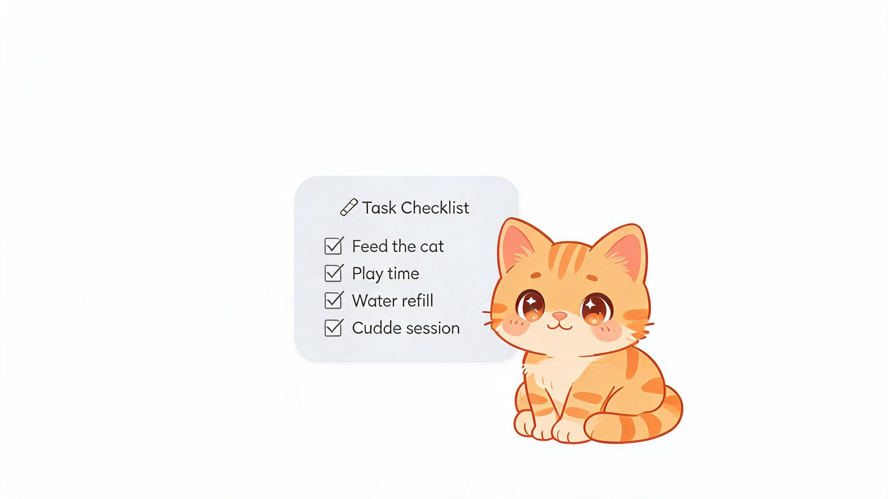
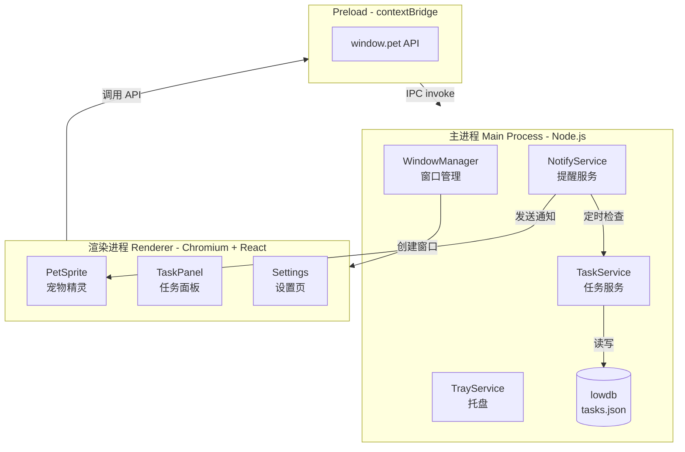

# 🐱 桌面宠物任务助手

> 一只常驻 Windows 桌面的小宠物，帮你记录和提醒每天的任务。右键添加、双击完成、到点弹气泡，轻量不打扰。



<p align="center">
  <a href="./docs/DESIGN.md"></a>
  
  
  
  
  
  
</p>

---

## ✨ 功能特性

| 功能 | 描述 | 状态 |
| ---- | ---- | ---- |
| 🐾 **常驻陪伴** | 透明置顶窗口，宠物常驻桌面右下角 | ✅ |
| 🖱️ **自由拖拽** | 鼠标按住宠物即可拖到屏幕任意位置 | ✅ |
| 📋 **任务管理** | 添加 / 完成 / 删除 / 备注 / 定时 | ✅ |
| ⏰ **智能提醒** | 到点弹气泡 + 系统通知 + 跳跃动画 | ✅ |
| 🎨 **多种皮肤** | 猫咪 / 小狗 / 机器人（纯 SVG 绘制） | ✅ |
| 🗂️ **系统托盘** | 托盘图标右键菜单，失焦自动隐藏面板 | ✅ |
| ⚙️ **设置面板** | 置顶 / 提醒 / 声音 / 开机自启 | ✅ |
| ⌨️ **全局快捷键** | `Ctrl+Shift+P` 一键呼出宠物 | ✅ |
| 💾 **离线可用** | 数据本地存储，零依赖云端 | ✅ |
| 📦 **一键打包** | electron-builder 生成 NSIS 安装包 | ✅ |

---

## 🎯 核心交互一览

```
┌────────────────────────────────────────────────────────────┐
│                    桌面宠物交互方式                          │
├────────────────────────────────────────────────────────────┤
│                                                            │
│   左键单击  ───►  展开 / 收起任务面板                         │
│                                                            │
│   左键双击  ───►  快速添加任务（聚焦输入框）                  │
│                                                            │
│   右键单击  ───►  上下文菜单                                │
│                   ├── 📋 添加任务                          │
│                   ├── ⚙️ 设置                             │
│                   └── 🚪 退出                             │
│                                                            │
│   鼠标拖拽  ───►  移动宠物到任意位置                         │
│                                                            │
│   鼠标悬停  ───►  显示今日待办概要                          │
│                                                            │
│   任务到点  ───►  🔔 系统通知 + 💬 气泡 + 🐱 跳跃动画        │
│                                                            │
└────────────────────────────────────────────────────────────┘
```

---

## 🏗️ 技术栈

| 层级 | 技术 | 选型理由 |
|------|------|---------|
| 桌面框架 | **Electron 31** | Windows 体验最稳定，生态成熟 |
| 构建工具 | **electron-vite + Vite 5** | 极速 HMR，原生 ESM |
| 渲染层 | **React 18** | 组件化便于维护 |
| 语言 | **TypeScript 5** | 类型安全 |
| 样式 | **CSS + CSS Variables** | 零运行时开销，毛玻璃效果 |
| 本地存储 | **lowdb (JSON)** | 轻量、零依赖、便于调试 |
| 打包 | **electron-builder** | 一键生成 NSIS 安装包 |

---

## 📁 项目结构

```
desktop-pet-tasks/
├── 📂 docs/                       # 项目文档
│   ├── DESIGN.md                  # 初步设计文档
│   └── assets/                    # 文档图片
│       └── banner.jpg
│
├── 📂 src/
│   ├── 📂 main/                   # 🔵 主进程（Node.js 环境）
│   │   ├── index.ts               # 主进程入口
│   │   ├── 📂 windows/            # 窗口管理
│   │   │   ├── petWindow.ts       #   宠物透明窗口
│   │   │   ├── taskWindow.ts      #   任务面板窗口
│   │   │   └── settingsWindow.ts  #   设置窗口
│   │   ├── 📂 services/           # 业务服务
│   │   │   ├── storeService.ts    #   lowdb 封装
│   │   │   ├── taskService.ts     #   任务 CRUD
│   │   │   ├── notifyService.ts   #   提醒服务
│   │   │   └── trayService.ts     #   系统托盘
│   │   ├── 📂 ipc/                # IPC 处理器
│   │   │   ├── taskIpc.ts
│   │   │   ├── settingsIpc.ts
│   │   │   └── windowIpc.ts
│   │   └── 📂 config/
│   │       └── constants.ts       # 常量定义
│   │
│   ├── 📂 preload/                # 🟡 预加载脚本
│   │   └── index.ts               # contextBridge 暴露安全 API
│   │
│   ├── 📂 renderer/               # 🟢 渲染进程（React）
│   │   ├── index.html
│   │   └── 📂 src/
│   │       ├── main.tsx           # React 入口
│   │       ├── router.tsx         # 极简 hash 路由
│   │       ├── 📂 pages/
│   │       │   ├── Pet.tsx        #   宠物页
│   │       │   ├── TaskPanel.tsx  #   任务面板
│   │       │   └── Settings.tsx   #   设置页
│   │       ├── 📂 components/
│   │       │   ├── PetSprite.tsx  #   宠物 SVG 精灵
│   │       │   └── TaskItem.tsx   #   任务项
│   │       ├── 📂 hooks/
│   │       │   ├── useTask.ts     #   任务数据 Hook
│   │       │   └── useDrag.ts     #   拖拽 Hook
│   │       ├── 📂 styles/
│   │       │   └── global.css
│   │       └── 📂 utils/
│   │           └── date.ts
│   │
│   └── 📂 shared/                 # 🟣 主/渲染进程共享
│       └── types.ts               # TypeScript 类型
│
├── 📂 resources/                  # 应用资源
│   ├── icon-preview.jpg           # 图标预览
│   └── pet/                       # 宠物素材（可选）
│
├── package.json
├── electron.vite.config.ts
├── electron-builder.yml           # 打包配置
├── tsconfig.json / tsconfig.node.json / tsconfig.web.json
└── README.md                      # 本文件
```

### 系统架构



---

## 🚀 快速开始

### 环境要求

| 工具 | 最低版本 | 备注 |
|------|---------|------|
| Node.js | 18+ | 推荐 20 LTS |
| npm | 9+ | 或 pnpm / yarn |
| Git | 2.30+ | |
| Windows | 10 / 11 | 当前主要支持平台 |

### 1️⃣ 克隆仓库

```bash
git clone <your-repo-url> desktop-pet-tasks
cd desktop-pet-tasks
```

### 2️⃣ 安装依赖

```bash
npm install
```

> 💡 如果在中国大陆，建议使用淘宝镜像加速：
> ```bash
> npm config set registry https://registry.npmmirror.com
> npm config set electron_mirror https://registry.npmmirror.com/-/binary/electron/
> npm config set electron_builder_binaries_mirror https://registry.npmmirror.com/-/binary/electron-builder-binaries/
> ```

### 3️⃣ 启动开发模式

```bash
npm run dev
```

启动后：

- 🐱 一只橘色小猫出现在屏幕右下角
- 🖱️ 左键单击宠物展开任务面板
- 🖱️ 右键单击宠物显示菜单
- 🖱️ 按住宠物可拖拽到任意位置

---

## 🛠️ 本地测试与开发

### 开发命令一览

| 命令 | 作用 |
|------|------|
| `npm run dev` | 启动开发模式（HMR 热更新） |
| `npm run build` | 构建生产产物到 `out/` |
| `npm run preview` | 预览构建产物 |
| `npm run typecheck` | TypeScript 类型检查 |
| `npm run build:win` | 打包 Windows 安装包到 `release/` |
| `npm run build:mac` | 打包 macOS dmg |
| `npm run build:linux` | 打包 Linux AppImage |

### 调试技巧

1. **打开 DevTools**

   开发模式下，宠物窗口默认隐藏 DevTools（避免影响透明窗口交互）。可在 [src/main/windows/petWindow.ts](src/main/windows/petWindow.ts) 中加入：
   ```ts
   win.webContents.openDevTools({ mode: 'detach' })
   ```

2. **查看本地数据库**

   任务数据存储在 Electron 的 `userData` 目录下：
   - **Windows**: `%APPDATA%/桌面宠物任务助手/tasks.json`
   - **macOS**: `~/Library/Application Support/桌面宠物任务助手/tasks.json`
   - **Linux**: `~/.config/桌面宠物任务助手/tasks.json`

   直接用编辑器打开即可查看 / 修改数据。

3. **快速验证任务提醒**

   在任务面板中添加一个「过期时间」为 1 分钟后的任务，等待 30 秒内即可看到提醒气泡 + 系统通知。

### 验收测试清单

开发完成后，按以下清单手动验收：

- [ ] 启动应用，宠物出现在屏幕右下角
- [ ] 左键单击宠物 → 任务面板展开
- [ ] 再次单击 → 任务面板收起
- [ ] 按住宠物拖拽 → 宠物跟随移动
- [ ] 右键宠物 → 显示上下文菜单
- [ ] 在任务面板添加任务 → 列表立即刷新
- [ ] 双击任务复选框 → 标记为已完成
- [ ] 删除任务 → 列表立即移除
- [ ] 添加带过期时间的任务 → 到点弹出系统通知 + 宠物跳跃
- [ ] 托盘图标右键 → 显示退出菜单
- [ ] `Ctrl+Shift+P` → 全局快捷键呼出宠物
- [ ] 设置页切换皮肤 → 宠物形象立即变化

---

## 📦 打包发布

### 生成 Windows 安装包

```bash
npm run build:win
```

打包完成后，`release/` 目录下会生成：

```
release/0.1.0/
├── 桌面宠物任务助手 0.1.0.exe       # NSIS 在线安装包
├── 桌面宠物任务助手 0.1.0 Setup.exe  # NSIS 完整安装包
└── win-unpacked/                    # 解压版（免安装）
    └── 桌面宠物任务助手.exe
```

> ⚠️ 首次打包需要下载 electron-builder 二进制（约 100MB），请耐心等待。

### 自定义图标

替换以下文件即可自定义应用图标：

| 文件 | 用途 | 建议尺寸 |
|------|------|---------|
| `resources/icon.ico` | Windows 应用图标 | 256x256 |
| `resources/icon.icns` | macOS 应用图标 | 512x512 |
| `resources/tray-icon.png` | 系统托盘图标 | 32x32 |

---

## 📐 设计文档

详细的架构设计、模块划分、IPC 通道、数据模型请见：

👉 **[docs/DESIGN.md](docs/DESIGN.md)**

包含：
- 系统架构图
- 进程职责划分
- IPC 通道设计表
- 数据模型定义
- 开发里程碑
- 风险与待确认事项

---

## 🗺️ 路线图

- [x] **M0** 项目搭建与文档
- [x] **M1** 宠物透明窗口 + 拖拽
- [x] **M2** 任务 CRUD + 面板 UI
- [x] **M3** 定时提醒 + 系统托盘
- [x] **M4** 设置面板 + Windows 打包
- [ ] **M5** 任务统计与周报
- [ ] **M6** 多皮肤扩展与动画系统（Lottie）
- [ ] **M7** 数据导出 / 导入

---

## ❓ 常见问题

<details>
<summary><b>1. 为什么启动后宠物不显示？</b></summary>

可能是显卡驱动对透明窗口支持不佳。在 [src/main/index.ts](src/main/index.ts) 中取消注释：
```ts
app.disableHardwareAcceleration()
```
</details>

<details>
<summary><b>2. 任务数据存哪里？能云同步吗？</b></summary>

数据存储在 `app.getPath('userData')/tasks.json`，是纯 JSON 文件。v1 不支持云同步，但你可以手动复制该文件到其他设备实现"伪同步"。
</details>

<details>
<summary><b>3. macOS / Linux 能用吗？</b></summary>

代码已做跨平台兼容，但当前主要针对 Windows 测试。macOS 下宠物会出现在 Dock 上方而非右下角，可在设置中后续优化。
</details>

<details>
<summary><b>4. 怎么让宠物开机自启？</b></summary>

打开「设置」面板，开启「开机自启」开关即可。底层调用 `app.setLoginItemSettings`。
</details>

---

## 🤝 贡献指南

1. Fork 本仓库
2. 创建特性分支：`git checkout -b feature/your-feature`
3. 提交更改：`git commit -m 'feat: add your feature'`
4. 推送分支：`git push origin feature/your-feature`
5. 提交 Pull Request

提交信息遵循 [Conventional Commits](https://www.conventionalcommits.org/) 规范：

| 前缀 | 用途 |
|------|------|
| `feat:` | 新功能 |
| `fix:` | Bug 修复 |
| `docs:` | 文档变更 |
| `style:` | 代码格式（不影响功能） |
| `refactor:` | 重构 |
| `test:` | 测试 |
| `chore:` | 构建/工具变更 |

---

## 📄 许可证

[MIT License](LICENSE)

---

## 🙏 致谢

- [Electron](https://www.electronjs.org/) - 跨平台桌面应用框架
- [React](https://react.dev/) - UI 库
- [Vite](https://vitejs.dev/) - 下一代构建工具
- [lowdb](https://github.com/typicode/lowdb) - 轻量 JSON 数据库
- [electron-vite](https://electron-vite.org/) - Electron + Vite 集成方案

---

<p align="center">
  Made with ❤️ by KPBL Team<br>
  如果这个项目对你有帮助，欢迎 ⭐ Star 支持！
</p>
