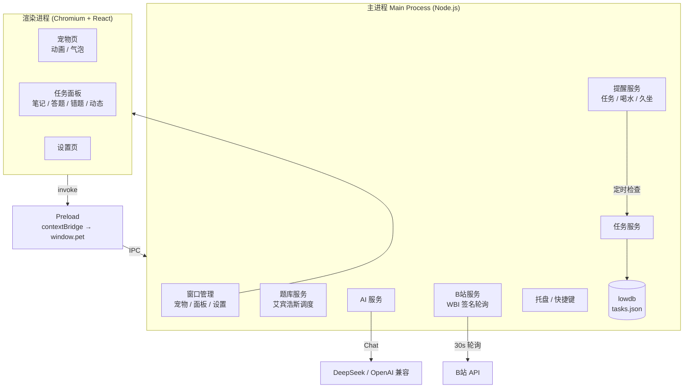

<div align="center">

# PalGo

**一只常驻桌面的水豚，陪你刷题、追更、管理待办**

[](https://www.electronjs.org/)
[](https://react.dev/)
[](https://www.typescriptlang.org/)
[](https://vitejs.dev/)
[](#)
[](LICENSE)

桌面宠物 × 任务管理 × 刷题复习 × B站动态追踪，全部本地存储，离线可用。

</div>

---

## 目录

- [简介](#简介)
- [功能特性](#功能特性)
- [界面预览](#界面预览)
- [快速开始](#快速开始)
- [项目结构](#项目结构)
- [系统架构](#系统架构)
- [开发指南](#开发指南)
- [打包发布](#打包发布)
- [常见问题](#常见问题)
- [贡献指南](#贡献指南)
- [许可证](#许可证)

---

## 简介

PalGo 是一款 Windows 桌面应用：一只名叫「噜噜」的水豚常驻你的桌面右下角。它不只是宠物——双击它会展开一个毛玻璃面板，里面装着你的待办事项、题库练习、错题复习和关注的 B 站 UP 主动态。到点的任务、新发布的动态会通过系统通知推给你，久坐了、该喝水了它也会气泡提醒。

所有数据保存在本地 JSON 文件中，不依赖任何云服务。

### 核心场景

- **备考刷题**：内置 JSON 题库（教师招聘、事业编、408 等），答题即时判分，答错自动进错题本
- **记忆巩固**：错题按艾宾浩斯遗忘曲线安排 7 阶段间隔复习（10 分钟 → 30 天）
- **动态追踪**：关注 B 站 UP 主，新动态实时系统通知
- **日常待办**：任务管理 + 到点提醒 + 健康（喝水/久坐）提醒

---

## 功能特性

### 桌面宠物

| 功能 | 说明 |
|------|------|
| 常驻陪伴 | 110×110 透明置顶窗口，可拖拽到屏幕任意位置 |
| 帧动画 | 竖排 Sprite Sheet 逐帧动画，6 种状态（待机/开心/警觉/拖拽/答对/答错），加载失败自动降级 SVG |
| 对话气泡 | 头顶气泡显示提醒内容，4 秒自动消失 |
| 双击交互 | 双击宠物展开/收起任务面板，全快捷键操作 |

### 任务管理

| 功能 | 说明 |
|------|------|
| 任务 CRUD | 标题 + 备注 + 到期时间，回车快速添加 |
| 按日管理 | 任务归属日期，今日待办/已完成数量统计 |
| 到点提醒 | 30 秒轮询到期任务，系统通知（可带声音）+ 宠物警觉动画 |

### 刷题练习

| 功能 | 说明 |
|------|------|
| JSON 题库 | 读取 `resources/question-banks/` 下的 JSON 文件，可自由扩展 |
| 题型支持 | 单选 / 多选 / 判断 / 简答 |
| 即时判分 | 选中即判，对错高亮，立即显示解析 |
| 答题快捷键 | A/B/C/D 选择、Enter 下一题等，全部可自定义录制 |
| 进度持久化 | 按题库保存进度与答题记录，支持「继续答题」 |

### 错题复习（艾宾浩斯）

| 功能 | 说明 |
|------|------|
| 自动收集 | 答错即入库，记录错次与答案 |
| 7 阶段间隔 | 10 分钟 → 1 天 → 2 天 → 4 天 → 7 天 → 15 天 → 30 天 |
| 智能调度 | 复习答对进入下一阶段，答错回到第一阶段；通过全部阶段自动移出 |
| 到期管理 | 「现在该复习 / 接下来」分组展示剩余时间，支持按题库筛选 |

### AI 解析

| 功能 | 说明 |
|------|------|
| 双服务商 | DeepSeek 或任意 OpenAI Chat Completions 兼容接口 |
| 答题解析 | 答完题一键请求 AI 解析，提示词模板可自定义变量 |
| 可靠性 | 30 秒超时 + 429/5xx 退避重试，Key 仅保存在本机 |

### B 站动态追踪

| 功能 | 说明 |
|------|------|
| 添加关注 | 支持空间链接 / UID / b23.tv 短链 |
| 定时轮询 | 默认 30 秒（15–300 秒可调），WBI 签名 + buvid 指纹绕过风控 |
| 新动态通知 | 系统通知（点击直达）+ 宠物气泡 + 动态页实时刷新 |
| 历史回填 | 展示最近 3 天动态，按日期分组，启动时自动补齐离线期间缺口 |

### 系统集成

| 功能 | 说明 |
|------|------|
| 系统托盘 | 显示宠物 / 打开设置 / 退出 |
| 全局快捷键 | `Ctrl+Shift+P` 面板 · `Ctrl+Shift+H` 宠物 · `Ctrl+Shift+S` 设置（可自定义） |
| 健康提醒 | 喝水（默认 30 分钟）与久坐站立（默认 60 分钟）气泡提醒 |
| 开机自启 | 系统托盘常驻，单实例锁 |

---

## 界面预览

> 整体采用 Apple 设计语言：SF 字体栈、iOS 系统色板（`#F2F2F7` 分组背景、白色表面卡片、发丝分隔线）、毛玻璃振动质感、iOS 分组列表模式。


---

## 快速开始

### 环境要求

| 依赖 | 版本 | 说明 |
|------|------|------|
| Node.js | ≥ 18 | 推荐 20 LTS |
| npm | ≥ 9 | 或 pnpm / yarn |
| Git | ≥ 2.30 | |
| Windows | 10 / 11 | 当前主要支持平台 |

### 安装与运行

```bash
# 1. 克隆仓库
git clone https://github.com/Allen-huu/PalGov.git
cd PalGov

# 2. 安装依赖
npm install

# 3. 启动开发模式（HMR 热更新）
npm run dev
```

启动后水豚出现在屏幕右下角，双击呼出面板即可开始使用。

> **中国大陆网络建议**：安装前配置镜像加速
>
> ```bash
> npm config set registry https://registry.npmmirror.com
> npm config set electron_mirror https://registry.npmmirror.com/-/binary/electron/
> npm config set electron_builder_binaries_mirror https://registry.npmmirror.com/-/binary/electron-builder-binaries/
> ```

---

## 项目结构

```
PalGo/
├── docs/                            # 项目文档
│   ├── DESIGN.md                    # 架构设计文档
│   ├── CAPYBARA_DESIGN.md           # 水豚形象设计
│   └── assets/                      # 文档图片
│
├── resources/                       # 应用资源（打包进安装包）
│   ├── icon.ico / icon.png          # 应用图标
│   ├── tray-icon.png                # 托盘图标
│   └── question-banks/              # JSON 题库目录
│
├── src/
│   ├── main/                        # 🔵 主进程（Node.js）
│   │   ├── index.ts                 # 入口：生命周期、单实例锁
│   │   ├── windows/                 # 窗口管理
│   │   │   ├── petWindow.ts         #   宠物透明窗口
│   │   │   ├── taskWindow.ts        #   任务面板窗口
│   │   │   └── settingsWindow.ts    #   设置窗口
│   │   ├── services/                # 业务服务
│   │   │   ├── storeService.ts      #   lowdb 持久化
│   │   │   ├── taskService.ts       #   任务 CRUD
│   │   │   ├── notifyService.ts     #   任务/喝水/久坐提醒
│   │   │   ├── quizService.ts       #   题库加载 + 错题调度
│   │   │   ├── aiService.ts         #   AI 接口调用
│   │   │   ├── bilibiliService.ts   #   B站动态轮询（WBI 签名）
│   │   │   ├── shortcutService.ts   #   全局快捷键
│   │   │   └── trayService.ts       #   系统托盘
│   │   ├── ipc/                     # IPC 处理器
│   │   └── config/constants.ts      # 常量
│   │
│   ├── preload/                     # 🟡 预加载（contextBridge 安全 API）
│   │   └── index.ts                 #   window.pet.* 五组 API
│   │
│   ├── renderer/                    # 🟢 渲染进程（React）
│   │   └── src/
│   │       ├── main.tsx             #   入口
│   │       ├── router.tsx           #   极简 hash 路由
│   │       ├── pages/               #   5 个页面
│   │       │   ├── Pet.tsx          #     宠物页（动画 + 气泡 + 拖拽）
│   │       │   ├── TaskPanel.tsx    #     任务面板
│   │       │   ├── Quiz.tsx         #     答题页
│   │       │   ├── WrongBookContent.tsx # 错题复习页
│   │       │   ├── Bilibili.tsx     #     B站动态页
│   │       │   └── Settings.tsx     #     设置页
│   │       ├── components/          #   共享组件
│   │       │   ├── PanelSidebar.tsx #     面板侧边栏
│   │       │   ├── PetSprite.tsx    #     精灵动画
│   │       │   └── TaskItem.tsx     #     任务行
│   │       ├── hooks/               #   useTask / useDrag
│   │       ├── styles/global.css    #   设计系统（Apple 字阶令牌）
│   │       └── utils/               #   date / asset
│   │
│   └── shared/                      # 🟣 主/渲染进程共享
│       ├── types.ts                  #   类型定义
│       └── ipcChannels.ts           #   IPC 通道名
│
├── scripts/generate-ico.mjs         # 图标生成脚本
├── tools/sprite-stitcher.html       # 精灵图拼接工具
├── electron.vite.config.ts
├── electron-builder.yml
└── package.json
```

---

## 系统架构


```mermaid
graph TB
    subgraph Main["主进程 Main Process (Node.js)"]
        WM["窗口管理<br/>宠物 / 面板 / 设置"]
        TS["任务服务"]
        NS["提醒服务<br/>任务 / 喝水 / 久坐"]
        QS["题库服务<br/>艾宾浩斯调度"]
        AIS["AI 服务"]
        BS["B站服务<br/>WBI 签名轮询"]
        TR["托盘 / 快捷键"]
        DB[("lowdb<br/>tasks.json")]
    end

    subgraph Renderer["渲染进程 (Chromium + React)"]
        PET["宠物页<br/>动画 / 气泡"]
        PANEL["任务面板<br/>笔记 / 答题 / 错题 / 动态"]
        SETTINGS["设置页"]
    end

    PRELOAD["Preload<br/>contextBridge → window.pet"]

    WM --> Renderer
    TS --> DB
    NS -->|定时检查| TS
    BS -->|30s 轮询| BILI["B站 API"]
    AIS -->|Chat| LLM["DeepSeek / OpenAI 兼容"]

    Renderer -->|invoke| PRELOAD
    PRELOAD -->|IPC| Main
```

**数据流向**：渲染进程通过 `window.pet.*` 调用 preload 暴露的 API → IPC invoke 到主进程 → 服务层读写 lowdb / 调用外部接口 → 事件推回渲染进程刷新 UI。

---

## 开发指南

### 常用命令

| 命令 | 作用 |
|------|------|
| `npm run dev` | 启动开发模式（HMR） |
| `npm run build` | 构建生产产物到 `out/` |
| `npm run typecheck` | TypeScript 类型检查（node + web） |
| `npm run build:win` | 打包 Windows NSIS 安装包 |

### 自定义题库

在 `resources/question-banks/` 新建 JSON 文件：

```json
{
  "name": "我的题库",
  "description": "题库描述",
  "questions": [
    {
      "id": "q1",
      "type": "single_choice",
      "question": "题目内容",
      "options": ["选项A", "选项B", "选项C", "选项D"],
      "answer": 0,
      "explanation": "解析"
    }
  ]
}
```

题型：`single_choice` 单选 · `multiple_choice` 多选（`answer` 为数组） · `true_false` 判断 · `short_answer` 简答。

### 添加宠物皮肤

1. 用 `tools/sprite-stitcher.html` 将动画帧竖向拼接为 Sprite Sheet
2. 放入 `src/renderer/public/assets/sprites/`
3. 动画加载失败时会自动降级为内置 SVG 水豚

### 调试技巧

- **打开 DevTools**：在 `src/main/windows/petWindow.ts` 中加 `win.webContents.openDevTools({ mode: 'detach' })`
- **查看本地数据**：`%APPDATA%/PalGo/tasks.json`（任务 / 设置 / 错题 / B站关注）
- **验证提醒**：添加一个 1 分钟后到期的任务，30 秒内即可看到系统通知 + 宠物动画

---

## 打包发布

```bash
npm run build:win
```

产物位于 `release/` 目录：

```
release/
└── 0.1.6/
    ├── PalGo 0.1.6.exe          # NSIS 安装包
    └── win-unpacked/            # 免安装解压版
```

> 首次打包需下载 electron-builder 二进制（约 100 MB）。

---

## 常见问题

<details>
<summary><b>启动后宠物不显示？</b></summary>

可能是显卡驱动对透明窗口支持不佳，在 `src/main/index.ts` 中取消注释 `app.disableHardwareAcceleration()`。

</details>

<details>
<summary><b>B站动态拉取失败 / 一直转圈？</b></summary>

动态接口需要 WBI 签名（已内置自动处理）。若仍被风控拦截（页面上方有黄色警告条），在设置页「B站动态跟踪 → Cookie」中粘贴浏览器登录后的 Cookie 即可。

</details>

<details>
<summary><b>收不到系统通知？</b></summary>

检查 Windows 设置 → 系统 → 通知，确认全局通知开启且允许 PalGo 通知。

</details>

<details>
<summary><b>数据存在哪里？能同步吗？</b></summary>

`%APPDATA%/PalGo/tasks.json` 纯 JSON 文件。暂不支持云同步，手动复制该文件即可迁移设备。

</details>

<details>
<summary><b>macOS / Linux 能用吗？</b></summary>

代码已做跨平台兼容（macOS 隐藏 Dock），但当前仅针对 Windows 测试。

</details>

---

## 贡献指南

1. Fork 本仓库
2. 创建特性分支：`git checkout -b feature/your-feature`
3. 提交更改（遵循 [Conventional Commits](https://www.conventionalcommits.org/)）：

| 前缀 | 用途 |
|------|------|
| `feat:` | 新功能 |
| `fix:` | Bug 修复 |
| `docs:` | 文档变更 |
| `refactor:` | 重构 |
| `chore:` | 构建 / 工具变更 |

4. 推送分支：`git push origin feature/your-feature`
5. 提交 Pull Request

---

## 许可证

[MIT License](LICENSE)

---

<div align="center">

Made with ❤️ by KPBL Team

如果这个项目对你有帮助，欢迎 ⭐ Star 支持！

</div>
